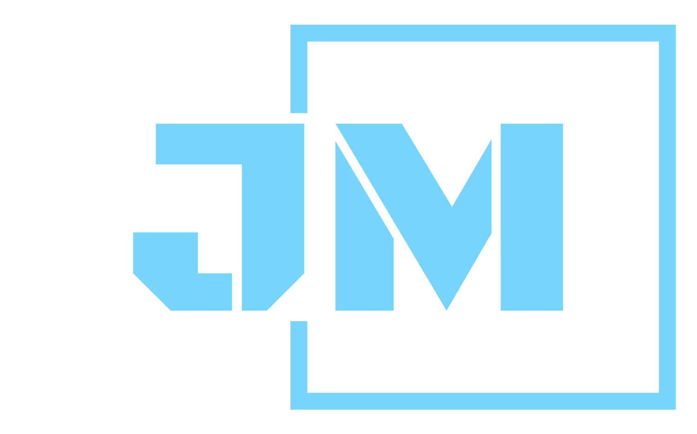

  <!-- PROJECT SHIELDS -->

[![Contributors][contributors-shield]][contributors-url]
[![Forks][forks-shield]][forks-url]
[![Stargazers][stars-shield]][stars-url]
[![Issues][issues-shield]][issues-url]
[![MIT License][license-shield]][license-url]
[![LinkedIn][linkedin-shield]][linkedin-url]

  <!-- PROJECT LOGO -->

   
  

    
    <h1 align="center">juliambamarah.com</h1>
    

     
Crafting Connections through Code: Explore my journey, projects, and passions in this immersive portfolio powered by React. 
      <a href="https://github.com/JuliaMbamarah/my-portfolio/"><strong>Explore the docs »</strong></a>
       
       
      <a href="juliambamarah.com">View Live Website</a>      
    

  

